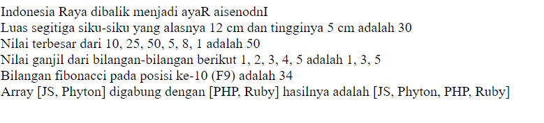

# Tugas Week 2 MOA Batch 10 Full Stack Development

## Soal
1. buat fungsi yang bertujuan untuk mengembalikan nilai reverse string : 
sebagai contoh :
input parameter : “Indonesia Raya” 
output yang diharapkan : “ayaR aisenodnI” 
2. buat fungsi yang bertujuan untuk menghitung luas segitiga siku-siku
3. buat fungsi yang bertujuan untuk mencari nilai terbesar dalam sebuah array
4. buat fungsi yang bertujuan untuk menampilkan nilai ganjil dalam sebuah array
5. buat fungsi untuk menampilkan bilangan fibonaci 
6. buat fungsi yang menerima 2 parameter berupa array dan gabungkan dua array tersebut di dalam fungsi yang telah dibuat.

## Output
